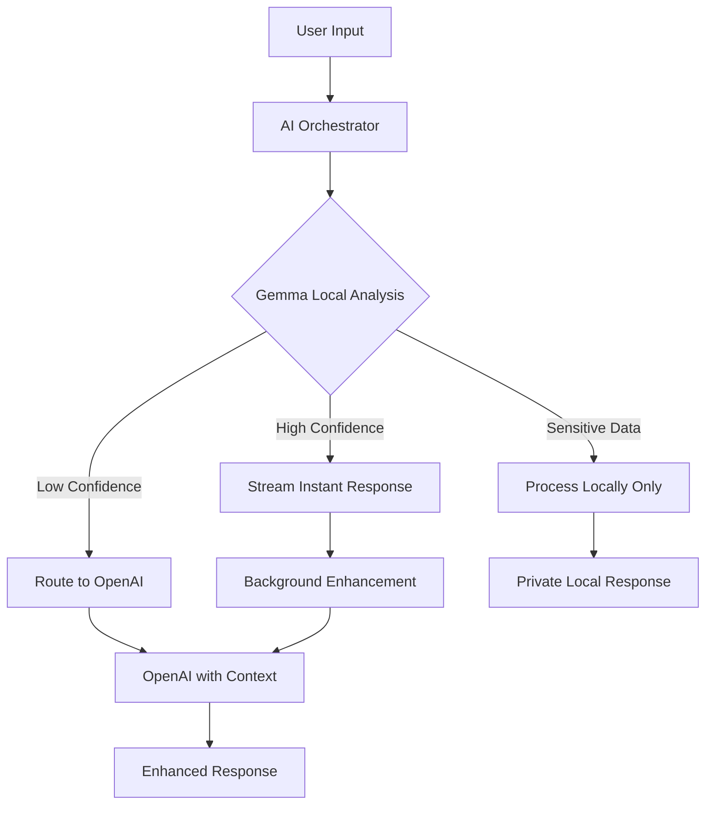

# Thrive App AI Architecture Design Document

## Executive Summary

This document outlines a comprehensive hybrid AI architecture for the Thrive app that combines on-device AI (Google Gemma) with cloud AI (OpenAI) to deliver instant, privacy-preserving, and intelligent health assistance. The solution addresses context awareness, scalability, and provides exceptional user experience while maintaining cost efficiency.

## Table of Contents

1. [Current State Analysis](#current-state-analysis)
2. [Proposed Hybrid AI Architecture](#proposed-hybrid-ai-architecture)
3. [Context Management System](#context-management-system)
4. [On-Device AI Integration (Gemma)](#on-device-ai-integration-gemma)
5. [Cloud AI Enhancement (OpenAI)](#cloud-ai-enhancement-openai)
6. [High-Value Features](#high-value-features)
7. [Implementation Architecture](#implementation-architecture)
8. [Privacy & Security](#privacy--security)
9. [Performance Targets](#performance-targets)
10. [Cost Optimization Strategy](#cost-optimization-strategy)
11. [Implementation Roadmap](#implementation-roadmap)

## Current State Analysis

### Existing Implementation
- **API Route**: `/app/api/assistant/stream/route.ts` - Handles OpenAI Assistant requests
- **Thread Management**: Uses OpenAI's Thread API for conversation persistence
- **Context Limitation**: No awareness of user's pantry items or active thrivings
- **Storage**: IndexedDB for offline-first data storage (pantry, thrivings, journals)

### Key Gaps
1. Assistant has no knowledge of user's pantry items or active thrivings
2. Each thread is isolated with no cross-thread awareness
3. Token usage accumulates without smart truncation
4. No offline AI capabilities
5. All AI processing requires internet connection

## Proposed Hybrid AI Architecture

### Dual-AI System Design

```typescript
interface HybridAISystem {
  // On-device AI (Gemma 3 1B via MediaPipe)
  localAI: {
    model: 'gemma-3-1b';
    size: '529MB';
    capabilities: [
      'instant_response',      // Sub-100ms responses
      'context_understanding', // Understand user intent
      'privacy_filtering',     // Filter sensitive data
      'offline_support',       // Full offline functionality
      'real_time_analysis'     // Analyze user input in real-time
    ];
  };
  
  // Cloud AI (OpenAI GPT-4 + Vector Stores)
  cloudAI: {
    model: 'gpt-4-turbo';
    capabilities: [
      'complex_reasoning',     // Advanced health insights
      'knowledge_retrieval',   // Vector store search
      'multi_agent_routing',   // Specialist agent handoffs
      'long_context_memory',   // Thread-based conversations
      'file_analysis'          // Document understanding
    ];
  };
  
  // Intelligent Router
  aiRouter: {
    mode: 'hybrid' | 'local_only' | 'cloud_only';
    fallback: 'graceful_degradation';
  };
}
```

### Request Flow Architecture



## Context Management System

### Unified Context Engine

```typescript
class UnifiedContextEngine {
  // Tiered context storage
  private contextLayers = {
    // Layer 1: Immediate context (stored locally, always available)
    immediate: {
      storage: 'indexeddb',
      data: ['active_thrivings', 'recent_pantry', 'current_symptoms'],
      maxSize: '5MB',
      gemmaOptimized: true
    },
    
    // Layer 2: Extended context (local with cloud backup)
    extended: {
      storage: 'indexeddb + cloud',
      data: ['all_thrivings', 'full_pantry', 'health_history'],
      maxSize: '50MB',
      syncStrategy: 'differential'
    },
    
    // Layer 3: Knowledge base (cloud vector stores)
    knowledge: {
      storage: 'openai_vector_stores',
      data: ['wellness_guides', 'nutrition_data', 'remedy_database'],
      searchable: true,
      embeddingCached: true
    }
  };
}
```

### Smart Context Injection Strategies

#### 1. Dynamic Context Injection
```typescript
// Context injected based on message relevance
const contextPrefix = `[CONTEXT: User has ${pantryItems.length} pantry items including ${topItems}. 
Active thrivings: ${activeThrivings.map(t => t.title).join(', ')}]`;
```

#### 2. Vector Store Integration
```typescript
// Multiple vector stores for different knowledge domains
const vectorStores = {
  wellness: 'vs_wellness_guides',      // General health info
  nutrition: 'vs_nutrition_data',      // Food/supplement data
  remedies: 'vs_natural_remedies',     // Holistic remedies
  userSpecific: `vs_user_${userId}`    // User-specific knowledge
};
```

#### 3. Thread Lifecycle Management
```typescript
// Intelligent thread management with insights extraction
class ThreadManager {
  async manageThreadLifecycle(userId: string, threadId: string) {
    const thread = await this.getThread(threadId);
    
    if (this.shouldArchive(thread)) {
      const insights = await this.extractThreadInsights(thread);
      await this.saveUserInsights(userId, insights);
      await this.archiveThread(thread);
    }
  }
}
```

## On-Device AI Integration (Gemma)

### Gemma 3 Capabilities
- **Model Size**: 529MB (Gemma 3 1B)
- **Performance**: Up to 2585 tokens/sec on prefill
- **Memory Requirements**: ~2GB
- **Platform**: WebGPU via MediaPipe
- **Context Window**: 2048 tokens

### Implementation

```typescript
class GemmaLocalService {
  private llmInference: any;
  
  async initialize() {
    const genai = await import('@mediapipe/tasks-genai');
    
    this.llmInference = await genai.LlmInference.createFromOptions({
      baseOptions: {
        modelAssetPath: '/models/gemma-3-1b.bin',
        delegate: 'GPU' // Use WebGPU
      },
      maxTokens: 2048,
      temperature: 0.7,
      topK: 40
    });
  }
  
  async quickResponse(prompt: string, context: LocalContext) {
    const enrichedPrompt = this.buildPrompt(prompt, context);
    const response = await this.llmInference.generateResponse(enrichedPrompt);
    return {
      text: response,
      confidence: this.calculateConfidence(response)
    };
  }
}
```

### Local AI Use Cases
1. **Instant Completions**: Type-ahead suggestions
2. **Privacy Filtering**: Identify sensitive content
3. **Intent Detection**: Understand query type
4. **Pattern Analysis**: Detect health trends
5. **Offline Support**: Full functionality without internet

## Cloud AI Enhancement (OpenAI)

### Enhanced OpenAI Service

```typescript
class EnhancedOpenAIService {
  private assistants: Map<string, Assistant>;
  private vectorStores: Map<string, string>;
  
  async initialize() {
    // Create specialized assistants
    this.assistants = {
      general: await this.createAssistant('general', ENHANCED_INSTRUCTIONS),
      nutrition: await this.createSpecialistAssistant('nutrition'),
      fitness: await this.createSpecialistAssistant('fitness'),
      mental: await this.createSpecialistAssistant('mental_health')
    };
    
    // Set up vector stores with knowledge bases
    this.vectorStores = await this.setupVectorStores();
  }
}
```

### Vector Store Strategy
- **Wellness Guides**: General health information
- **Nutrition Database**: Food and supplement data
- **Remedy Collection**: Natural remedies and treatments
- **User-Specific Stores**: Personalized knowledge (optional)

### Token Optimization
```typescript
const truncationStrategy = {
  type: "last_messages",
  last_messages: 20 // Keep last 20 messages
};

const run = await openai.beta.threads.runs.create(threadId, {
  assistant_id: assistantId,
  max_prompt_tokens: 5000,
  max_completion_tokens: 1000,
  truncation_strategy: truncationStrategy
});
```

## High-Value Features

### 1. Instant Health Companion
- **Response Time**: <100ms using Gemma
- **Features**:
  - Live symptom analysis as you type
  - Instant pantry-based remedy suggestions
  - Real-time thriving progress updates
  - Offline emergency guidance

### 2. Predictive Wellness
- **Local Analysis**: Gemma detects patterns
- **Cloud Insights**: OpenAI provides recommendations
- **Features**:
  - Tomorrow's wellness forecast
  - Preemptive supplement reminders
  - Mood prediction based on journal entries
  - Energy level optimization suggestions

### 3. Conversational Health Records
- **Input**: Natural language health updates
- **Processing**: Gemma extracts structured data
- **Storage**: Local encrypted database
- **Retrieval**: Ask questions about your health history

### 4. Smart Pantry Assistant
- **Visual**: Scan items with camera (Gemma 3n)
- **Suggestions**: Real-time recipe/remedy creation
- **Tracking**: Automatic expiration monitoring
- **Shopping**: AI-generated shopping lists

### 5. Adaptive Thrivings
- **Monitoring**: Gemma tracks completion patterns
- **Adjustment**: OpenAI modifies routines
- **Personalization**: Learn from user feedback
- **Motivation**: Dynamic encouragement messages

## Implementation Architecture

### Service Architecture

```typescript
const architecture = {
  // AI Services
  ai: {
    orchestrator: 'services/ai/AIOrchestrator.ts',
    gemma: 'services/ai/gemma/GemmaService.ts',
    openai: 'services/ai/openai/EnhancedOpenAIService.ts',
    router: 'services/ai/IntelligentRouter.ts'
  },
  
  // Context Management
  context: {
    engine: 'services/context/UnifiedContextEngine.ts',
    storage: 'services/context/HybridStorage.ts',
    embeddings: 'services/context/EmbeddingService.ts',
    cache: 'services/context/SemanticCache.ts'
  },
  
  // User Experience
  ux: {
    realTimeAssistant: 'components/ai/RealTimeAssistant.tsx',
    proactiveInsights: 'components/ai/ProactiveInsights.tsx',
    multiModal: 'components/ai/MultiModalInput.tsx',
    conversationalRecords: 'components/ai/ConversationalRecords.tsx'
  }
};
```

### AI Orchestrator

```typescript
class AIOrchestrator {
  async processUserMessage(message: string, userId: string) {
    // 1. Local AI processes instantly
    const localAnalysis = await this.gemmaService.analyze({
      message,
      context: await this.contextEngine.getLocalContext(userId)
    });
    
    // 2. Stream immediate response if confident
    if (localAnalysis.confidence > 0.8 && !localAnalysis.requiresCloudAI) {
      this.streamResponse(localAnalysis.response);
      
      // 3. Background enhancement with cloud AI
      this.enhanceWithCloudAI(message, localAnalysis, userId);
      return;
    }
    
    // 4. Complex queries go to cloud AI with local insights
    const enhancedQuery = {
      message,
      localInsights: localAnalysis.insights,
      intent: localAnalysis.intent,
      contextNeeds: localAnalysis.requestedContext
    };
    
    return this.openAIService.processWithContext(enhancedQuery, userId);
  }
}
```

## Privacy & Security

### Privacy-First Design

```typescript
class PrivacyManager {
  // All sensitive data stays local
  private sensitiveDataPatterns = [
    /medical condition/i,
    /medication/i,
    /symptom/i,
    /personal health/i
  ];
  
  async processWithPrivacy(message: string, userId: string) {
    // 1. Gemma identifies sensitive content locally
    const analysis = await this.gemma.analyzeSensitivity(message);
    
    // 2. If sensitive, process locally only
    if (analysis.isSensitive) {
      return this.processLocally(message, userId);
    }
    
    // 3. Otherwise, can use cloud with anonymization
    const anonymized = this.anonymize(message, analysis);
    return this.processWithCloud(anonymized, userId);
  }
}
```

### Data Flow Security
1. **Sensitive Data**: Never leaves device
2. **Anonymization**: Remove PII before cloud processing
3. **Encryption**: All local storage encrypted
4. **Audit Trail**: Track all AI interactions

## Performance Targets

| Metric | Target | Method |
|--------|--------|---------|
| Gemma Inference | <100ms | WebGPU acceleration |
| OpenAI First Token | <500ms | Streaming response |
| Context Retrieval | <50ms | IndexedDB + caching |
| UI Responsiveness | 60fps | React optimization |
| Offline Capability | 100% | Local AI + storage |
| Memory Usage | <100MB additional | Lazy loading |

## Cost Optimization Strategy

### Request Distribution
- **80% Local Processing**: Free with Gemma
- **15% Cached Responses**: Semantic similarity matching
- **5% Cloud Processing**: Complex queries only

### Cost Reduction Techniques

```typescript
class CostOptimizer {
  async optimizeCosts(requests: UserRequest[]) {
    // 1. Handle majority with local Gemma (free)
    const localHandled = await this.handleLocally(requests);
    
    // 2. Use semantic cache for similar queries
    const cached = await this.checkSemanticCache(requests);
    
    // 3. Batch remaining for OpenAI
    const cloudRequests = requests.filter(r => 
      !localHandled.includes(r) && !cached.includes(r)
    );
    
    return this.batchProcessWithOpenAI(cloudRequests);
  }
}
```

## Implementation Roadmap

### Fast-Track Implementation (5-7 Days)

#### Days 1-2: AI Foundation
**Team**: AI Integration Team
- Set up MediaPipe and Gemma model loading
- Implement basic Gemma inference service
- Create AIOrchestrator with routing logic
- Set up WebGPU detection and fallbacks

#### Days 3-4: Context & Storage
**Team**: Context & Storage Team (Parallel)
- Build UnifiedContextEngine
- Implement hybrid storage system
- Create embedding service for semantic search
- Set up OpenAI vector stores

#### Days 5-6: User Experience
**Team**: UX & Features Team
- Implement real-time suggestion UI
- Build conversational health records
- Create predictive wellness dashboard
- Add multi-modal input handling

#### Day 7: Integration & Launch
**Team**: Full Team
- Integration testing
- Performance optimization
- Privacy audit
- Production deployment

### Future Enhancements (Month 2-3)
1. Multi-agent specialists for different health domains
2. Federated learning for cross-user insights
3. Advanced voice interaction with Gemma
4. Export/import for data portability
5. Migration to OpenAI Responses API (when available)

## Conclusion

This hybrid AI architecture provides:
- **Instant responses** through on-device AI
- **Deep insights** via cloud AI when needed
- **Complete privacy** for sensitive health data
- **Cost efficiency** through smart routing
- **Superior UX** with predictive and proactive features

The system is designed to be future-proof, scalable, and delivers immediate value while maintaining user privacy and providing an exceptional health companion experience.